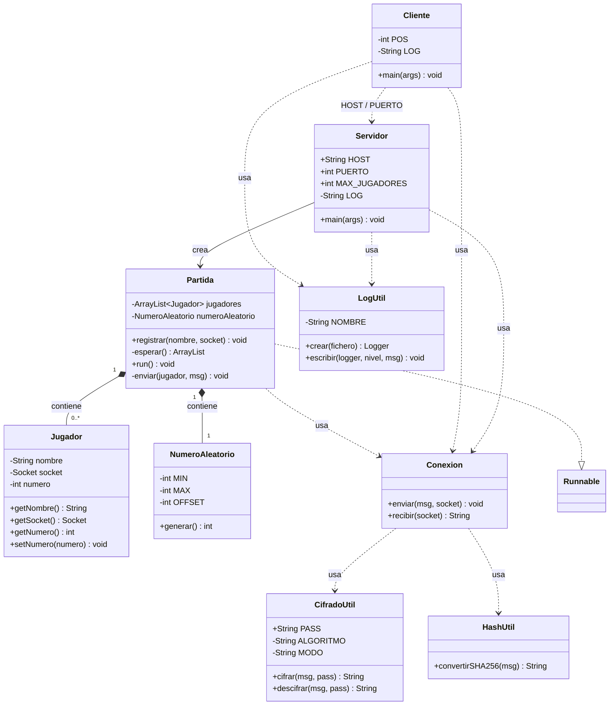

```mermaid
classDiagram
    direction TB

    class Servidor {
        +String HOST
        +int PUERTO
        +int MAX_JUGADORES
        -String LOG
        +main(args) void
    }

    class Cliente {
        -int POS
        -String LOG
        +main(args) void
    }

    class Partida {
        -ArrayList~Jugador~ jugadores
        -NumeroAleatorio numeroAleatorio
        +registrar(nombre, socket) void
        -esperar() ArrayList
        +run() void
        -enviar(jugador, msg) void
    }

    class Jugador {
        -String nombre
        -Socket socket
        -int numero
        +getNombre() String
        +getSocket() Socket
        +getNumero() int
        +setNumero(numero) void
    }

    class NumeroAleatorio {
        -int MIN
        -int MAX
        -int OFFSET
        +generar() int
    }

    class Conexion {
        +enviar(msg, socket) void
        +recibir(socket) String
    }

    class CifradoUtil {
        +String PASS
        -String ALGORITMO
        -String MODO
        +cifrar(msg, pass) String
        +descifrar(msg, pass) String
    }

    class HashUtil {
        +convertirSHA256(msg) String
    }

    class LogUtil {
        -String NOMBRE
        +crear(fichero) Logger
        +escribir(logger, nivel, msg) void
    }

    Partida ..|> Runnable

    Servidor --> Partida : crea
    Servidor ..> Conexion : usa
    Servidor ..> LogUtil : usa

    Cliente ..> Conexion : usa
    Cliente ..> LogUtil : usa
    Cliente ..> Servidor : HOST / PUERTO

    Partida "1" *-- "0..*" Jugador : contiene
    Partida "1" *-- "1" NumeroAleatorio : contiene
    Partida ..> Conexion : usa

    Conexion ..> CifradoUtil : usa
    Conexion ..> HashUtil : usa
```
